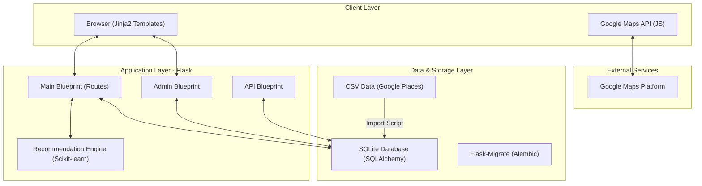

# Architecture

> Auto-generated on 2026-04-28

## Overview

**Hungry Bird** is a "Street Food Discovery" platform that helps users find and explore local food vendors ("Hidden Gems") in Indian cities. The system utilizes a Flask backend, a content-based recommendation engine, and server-side rendering for a fast, SEO-friendly experience.

## Components

### 1. Web Framework (Flask)
- **Purpose:** Handles HTTP requests, session management, and template rendering.
- **Location:** `app/`
- **Sub-components:**
    - `routes/main.py`: Public-facing routes (Home, City pages, Vendor submissions).
    - `routes/admin.py`: Management interface for reviewing submissions.
    - `routes/api.py`: Data endpoints for maps and internal services.

### 2. Recommendation Engine
- **Purpose:** Suggests similar vendors based on cuisine and descriptions.
- **Location:** `app/ml_model.py`
- **Methodology:** TF-IDF vectorization followed by Cosine Similarity calculation.

### 3. Data Layer (SQLAlchemy)
- **Purpose:** ORM for vendor, city, and submission data.
- **Location:** `app/models.py`
- **Entities:**
    - `City`: Geographical metadata.
    - `Vendor`: Core vendor data (ratings, cuisine, coordinates).
    - `VendorSubmission`: Staging area for user-suggested vendors.

### 4. Data Ingestion Pipeline
- **Purpose:** Populates the database from external CSV sources.
- **Location:** Root scripts (`import_from_csv.py`, `seed_delhi.py`).

## Data Flow

1. **User Request**: Browser hits `/city/<slug>`.
2. **Logic**: `main.py` fetches city vendors and passes them to `ml_model.py`.
3. **Intelligence**: `build_recommendation_model` calculates similarity scores on the fly (or from cache).
4. **Response**: Jinja2 renders `city.html` with vendor list, recommendations, and Google Maps pins.

## Integration Points

| Service | Type | Purpose |
|---------|------|---------|
| Google Maps JavaScript API | Client-side SDK | Interactive map displays |
| Google Maps Places API | External API | Geocoding and place verification (via scripts) |

## Technical Debt

- [ ] **ML Performance**: Model is rebuilt on every request for city pages; needs caching.
- [ ] **Validation**: Google Maps URL parsing is regex-based and could be brittle.
- [ ] **Assets**: Static assets (images) are currently linked directly to Google; consider local caching.
- [ ] **Search**: No global search functionality (only city-based listing).

## Conventions

**Naming:** Snake_case for Python, Kebab-case for slugs and routes.
**Structure:** Blueprint-based modularity in `app/routes`.
**Testing:** Currently lacks a formal `tests/` directory.
